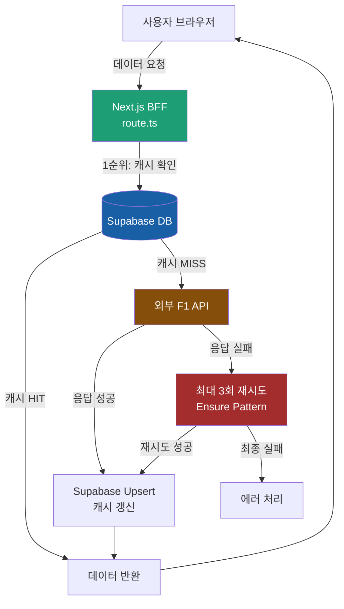

# 🏎️ AfterLap

> 한국 F1 팬들을 위한 레이스 결과 분석 플랫폼

**"이번 레이스에서 무슨 일이 있었지?"**

F1 경기를 놓친 팬이 공식 앱에서 4~5개 탭을 오가며 평균 5분 이상 소비하는 문제를 해결하기 위해,  
AfterLap은 **레이스 흐름을 한 화면에서 파악**할 수 있도록 설계한 웹 애플리케이션입니다.

- 5개 분산 API를 Supabase SQL View로 통합
- 드라이버 / 팀 / 시즌별 성적을 직관적으로 분석
- 한국어 중심 UI로 국내 팬 최적화

단순 뉴스 전달이 아닌,  
**“레이스가 끝난 이후(After Lap)”의 데이터를 정리하고 해석하는 것**에 초점을 둡니다.

---

## 🔍 주요 기능

- 🧑‍✈️ **드라이버 페이지**
  - 시즌별 순위, 소속 팀
  - Wins / Podiums / Poles 자동 계산
  - 연도별 커리어 흐름 시각화

- 🏎️ **팀 페이지**
  - 시즌별 드라이버 구성
  - 팀 컬러 & 아이덴티티 기반 UI
  - 연도별 팀 성적 비교

- 📅 **시즌 데이터 구조화**
  - 시즌(year) 기준 데이터 분리
  - 2023 ~ 2026 시즌 대응
  - 시즌 추가 시 자동 확장 가능

- 🇰🇷 **한국 팬 최적화**
  - 드라이버 한글 이름
  - 한국어 팀명 / 설명
  - 모바일 우선 UI

---

## 🖼️ Preview

> 모든 이미지는 비상업적 F1 팬 프로젝트 용도로 사용됩니다.

---

## 🛠️ Tech Stack

- **Framework**: Next.js (App Router)
- **Language**: TypeScript
- **Styling**: Tailwind CSS
- **Image**: next/image
- **State / Data**: Server Components + Derived Data
- **Deploy**: Vercel

---

## 🧠 기술적 의사결정

### 1. Supabase SQL View 기반 데이터 통합

**문제:**
- 5개 엔드포인트(/sessions, /drivers, /position, /pit, /weather)를 조합해야 레이스 요약 화면 구성 가능
- 프론트엔드에서 직접 집계 시 1,200개 데이터 정렬로 메인 스레드 블로킹

**해결:**
- PostgreSQL View로 5개 API를 DB 레벨에서 JOIN/집계
- 프론트엔드는 단일 API 호출로 완성된 데이터 조회
- View 수정만으로 집계 로직 변경 가능 (배포 불필요)

**결과:**
- 프론트엔드 집계 로직 0줄
- 초기 로딩 시간 대폭 개선

---

### 2. React Query로 외부 API Rate Limit 해결

**문제:**
- 5개 API를 Promise.all로 동시 호출 → Rate Limit(6 req/sec) 초과로 일부 요청 실패

**해결:**
- React Query의 enabled 옵션으로 API 호출 순서 제어
- 200ms 간격으로 API 호출 분산

**결과:**
- 배포 후 3개월간 Rate Limit 에러 0건

---

## 🚧 진행 상태

### ✅ 완료
- [x] 드라이버 상세 페이지 (시즌별 성적, 커리어 흐름)
- [x] 팀 목록 / 팀 페이지 (드라이버 구성, 팀 컬러)
- [x] 시즌별 데이터 구조 (2023-2026)
- [x] **레이스 요약 화면 (피트스탑, 포지션 변화)**
- [x] **5개 API 통합 (Supabase SQL View)**
- [x] **외부 API Rate Limit 해결 (React Query)**

### 🔜 예정
- [ ] 포인트 변화 그래프
- [ ] 즐겨찾기 드라이버
- [ ] 다국어 지원 (영어)

---

## ⚠️ Disclaimer

This project is a **non-commercial fan-made website**.  
Formula 1, F1, and all related trademarks are the property of their respective owners.

---

## 🙌 Author

- **남윤서**
- Frontend / Full-stack Developer
- F1 Fan 🏁

---

## ⭐️ Feedback & Contribution

이 프로젝트는 개인 팬 프로젝트입니다.  
아이디어, 개선 제안, 이슈 등록 언제든 환영합니다!
